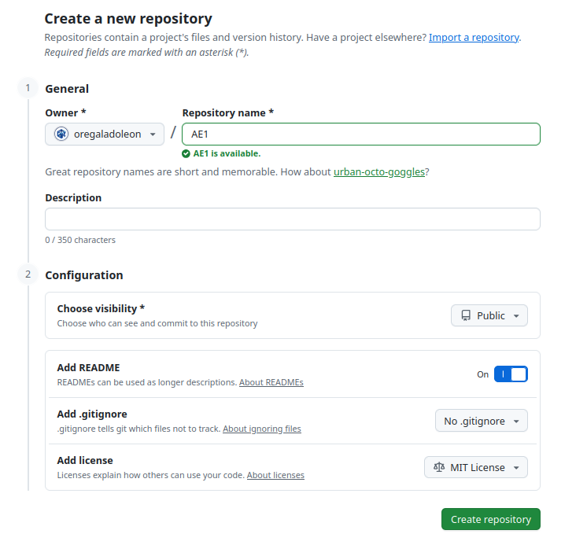
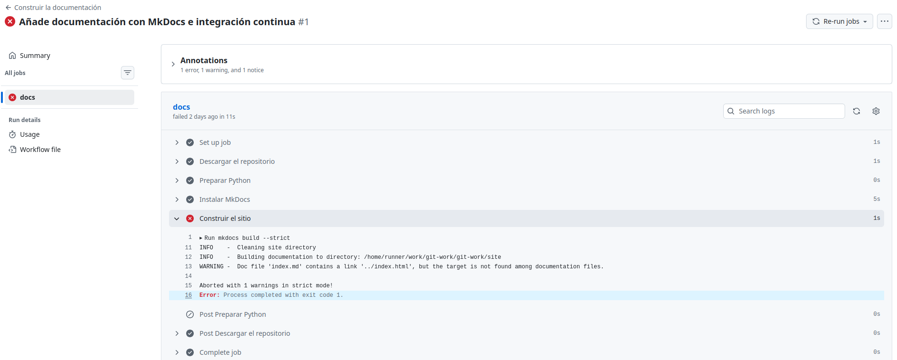
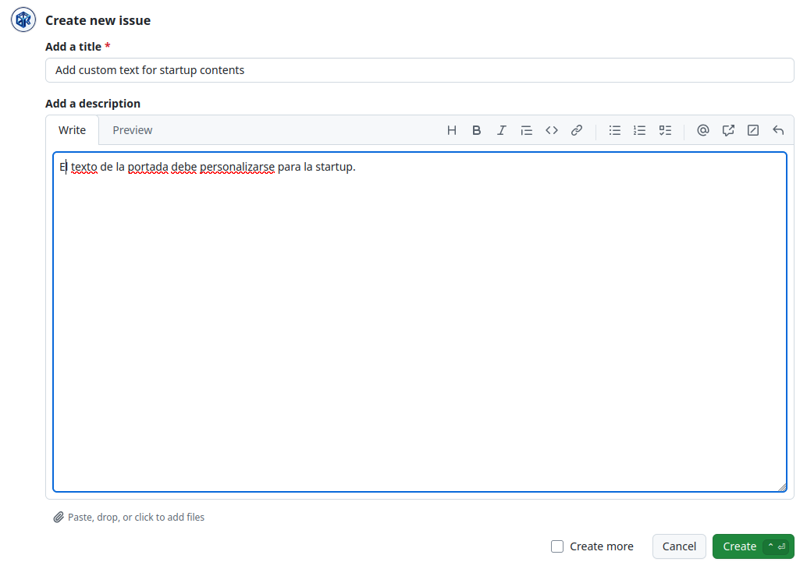
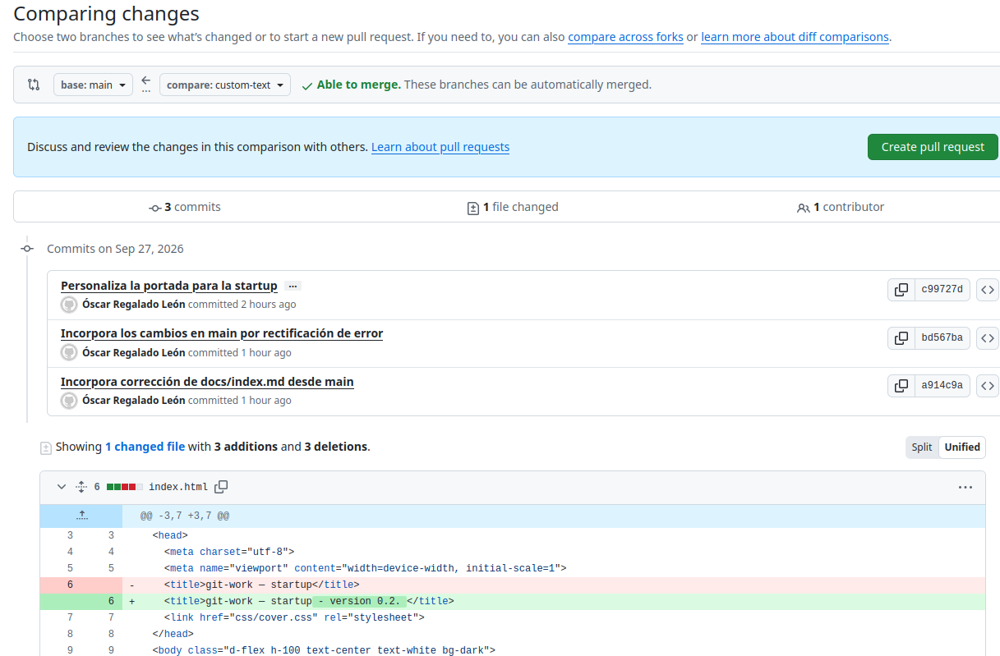
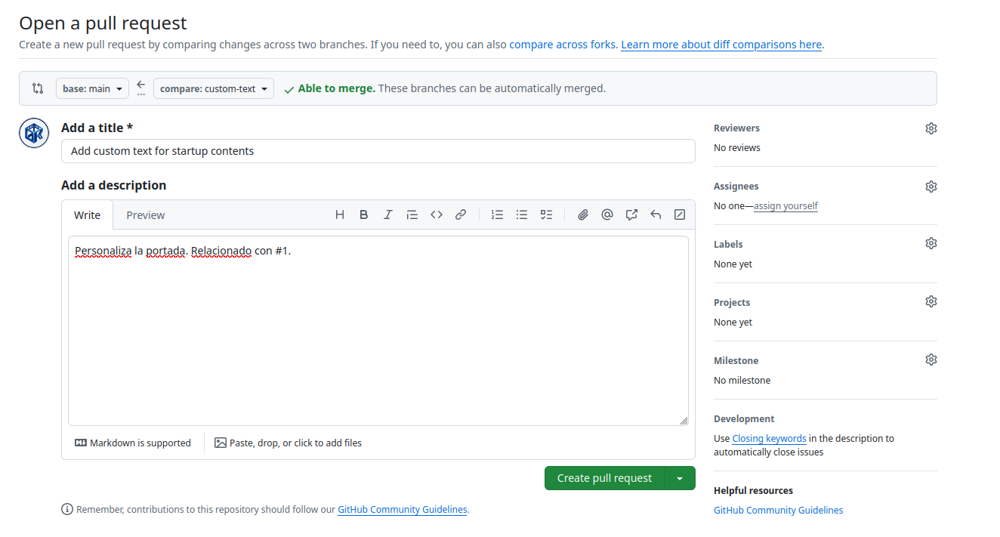
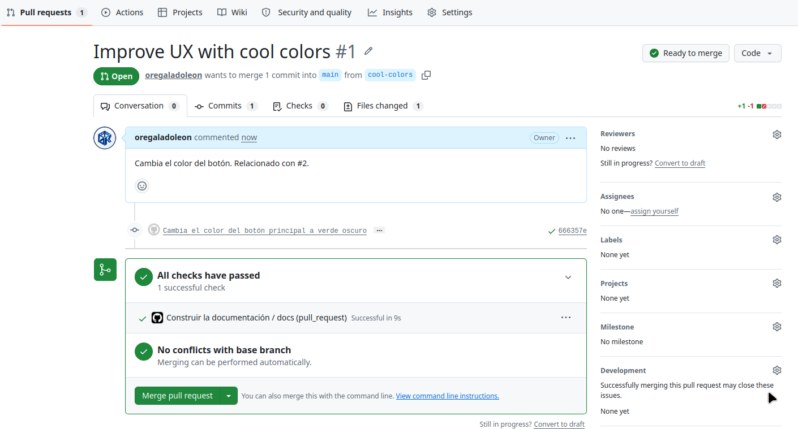

# git-work — Repositorio colaborativo Git
> Autor: Óscar Regalado León  
> Fecha: Septiembre 2026 

Creación de un repositorio en Git y Github. Simulación de un flujo de trabajo entre dos usuarios, aplicación de: (fork, issue, rama, PR, conflicto, etiqueta y release.

## Índice

- [Entorno e instalación](#entorno-e-instalacion)
- [Configuración](#configuracion)
- [Comprobación](#comprobacion)
- [Problemas encontrados y solución](#problemas-encontrados-y-solucion)
- [Repositorio remoto](#repositorio-remoto)

## Entorno e instalación
Accedemos a la web de [www.github.com](https://www.github.com) con el usuario del alumno, en este caso *oregaladoleon*, creamos un repositorio nuevo llamado **git-work** con visibilidad **Public** con **Add a README file** con **MIT License**  
  
Procedemos a clonar el repositorio en nuestro equipo, para ello:
~~~bash
cd ~/dpl
git clone git@github.com:oregaladoleon/git-work.git AE1    # Problema 1
Clonando en 'AE1'...
The authenticity of host 'github.com (140.82.121.3)' can't be established.
ED25519 key fingerprint is SHA256:+DiY3wvvV6TuJJhbpZisF/zLDA0zPMSvHdkr4UvCOqU.
This key is not known by any other names.
Are you sure you want to continue connecting (yes/no/[fingerprint])? yes
Warning: Permanently added 'github.com' (ED25519) to the list of known hosts.
git@github.com: Permission denied (publickey).
fatal: No se pudo leer del repositorio remoto.

Por favor asegúrate de que tengas los permisos de acceso correctos
y que el repositorio exista.
~~~
Creamos una pareja de claves **ssh** para poder clonar el repositorio:
~~~bash
ssh-keygen -t ed25519 -C "osrl90@gmail.com" 
Generating public/private ed25519 key pair.
Enter file in which to save the key (/home/oscar/.ssh/id_ed25519): 
Enter passphrase (empty for no passphrase): 
Enter same passphrase again: 
Your identification has been saved in /home/oscar/.ssh/id_ed25519
Your public key has been saved in /home/oscar/.ssh/id_ed25519.pub
The key fingerprint is:
SHA256:YCCI9xlIxKdEoN1bEnDEj6awsdAzmoqfQEeWWUE8Y3g osrl90@gmail.com
The key's randomart image is:
+--[ED25519 256]--+
|oB*=O+.          |
|+.==BE           |
|.+.O==*          |
|+ B ==..         |
|.O *.   S        |
|* o              |
|+                |
|o. .             |
| .o              |
+----[SHA256]-----+
~~~
Accedemos al fichero donde se aloja la clave:
~~~bash
bat ~/.ssh/id_ed25519.pub
~~~
Copiamos la clave y pegamos en la web de **GitHub** dentro de **Settings** -> **SSH and GPG Keys** -> **new SSH Key**
Comprobamos que la clave funciona:
~~~bash
ssh -T git@github.com
Hi oregaladoleon! You've successfully authenticated, but GitHub does not provide shell access.
~~~
Procedemos a clonar el repositorio:
~~~bash
git clone git@github.com:oregaladoleon/git-work.git AE1
Clonando en 'AE1'...
remote: Enumerating objects: 4, done.
remote: Counting objects: 100% (4/4), done.
remote: Compressing objects: 100% (3/3), done.
remote: Total 4 (delta 0), reused 0 (delta 0), pack-reused 0 (from 0)
Recibiendo objetos: 100% (4/4), listo.
~~~
Nos situamos en el proyecto y observamos la lista de las variables de configuración del repositorio y los servidores remotos vinculados al repositorio
~~~bash
git config --local --list
core.repositoryformatversion=0
core.filemode=true
core.bare=false
core.logallrefupdates=true
remote.origin.url=git@github.com:oregaladoleon/git-work.git
remote.origin.fetch=+refs/heads/*:refs/remotes/origin/*
branch.main.remote=origin
branch.main.merge=refs/heads/main

git remote -v
origin	git@github.com:oregaladoleon/git-work.git (fetch)
origin	git@github.com:oregaladoleon/git-work.git (push)
~~~
Creamos la página y hoja de estilos
~~~bash
mkdir -p css
touch index.html
touch ./css/cover.css
touch .gitignore
nano index.html  #copiamos y pegamos la plantilla propuesta por el docente
nano .gitignore #copiamos y pegamos la plantilla propuesta por el docente
nano ./css/cover.css #copiamos y pegamos la plantilla propuesta por el docente
~~~
Preparamos los archivos para añadirlos al repositorio git
~~~bash
git add index.html .gitignore css/cover.css 
git commit -m "Añade la página de la startup y su hoja de estilos" -m "Incluye index.html, css/cover.css (plantilla cover) y un .gitignore mínimo para entornos y logs."
[main f144c44] Añade la página de la startup y su hoja de estilos
 3 files changed, 90 insertions(+)
 create mode 100644 .gitignore
 create mode 100644 css/cover.css
 create mode 100644 index.html
git push origin main
Enumerando objetos: 7, listo.
Contando objetos: 100% (7/7), listo.
Compresión delta usando hasta 6 hilos
Comprimiendo objetos: 100% (4/4), listo.
Escribiendo objetos: 100% (6/6), 1.49 KiB | 761.00 KiB/s, listo.
Total 6 (delta 0), reusados 0 (delta 0), pack-reusados 0
To github.com:oregaladoleon/git-work.git
   5bb69d0..f144c44  main -> main
git log --oneline
f144c44 (HEAD -> main, origin/main, origin/HEAD) Añade la página de la startup y su hoja de estilos
5bb69d0 Initial commit
~~~
Procedemos a añadir el **workflow** de integración continua:
~~~bash
mkdir -p .github/workflows docs
touch .github/workflows/ci.yml
nano .github/workflows/ci.yml   # Añadimos la plantilla facilitada por el docente.
touch mkdocs.yml
nano mkdocs.yml     # Añadimos la plantilla facilitada por el docente.
touch docs/index.md
nano docs/index.md         # Añadimos la plantilla facilitada por el docente.
~~~
Volvemos a preparar los archivos para añadirlos al repositorio Git:
~~~bash
git add .github/workflows/ci.yml mkdocs.yml docs/index.md    
git commit -m "Añade documentación con MkDocs e integración continua" -m "Workflow que construye el sitio con mkdocs build --strict en cada push y pull request; la portada enlaza al sitio y al repositorio remoto."   
[main 6088d6e] Añade documentación con MkDocs e integración continua
 3 files changed, 33 insertions(+)
 create mode 100644 .github/workflows/ci.yml
 create mode 100644 docs/index.md
 create mode 100644 mkdocs.yml
git push origin main
Enumerando objetos: 9, listo.
Contando objetos: 100% (9/9), listo.
Compresión delta usando hasta 6 hilos
Comprimiendo objetos: 100% (5/5), listo.
Escribiendo objetos: 100% (8/8), 1.08 KiB | 276.00 KiB/s, listo.
Total 8 (delta 1), reusados 0 (delta 0), pack-reusados 0
remote: Resolving deltas: 100% (1/1), completed with 1 local object.
To github.com:oregaladoleon/git-work.git
   f144c44..6088d6e  main -> main
~~~
En este paso se produce un error, al comprobar en la web de **Github** el estado en **Actions** observamos que contiene un error

La solución se detalla en el apartado **Problemas encontrados y solución** de este documento.
Desde **GitHub** procedemos a crear una **Issue** con el texto especificado por el docente.

Debido a que realizamos la práctica de manera individual, tenemos que simular la intereacción de otro usuario, para ello, primero generamos un nuevo repositorio llamado **git-work-espejo** desde la web de **GitHub** y lo creamos **Público** sin **Readme.md** ni más opciones.
Luego accedemos a la terminal y dentro de la carpeta de trabajo **AE1** del proyecto:
~~~bash
git remote add espejo git@github.com:oregaladoleon/git-work-espejo.git
git push espejo main   #sube la rama main al espejo
Enumerando objetos: 18, listo.
Contando objetos: 100% (18/18), listo.
Compresión delta usando hasta 6 hilos
Comprimiendo objetos: 100% (12/12), listo.
Escribiendo objetos: 100% (18/18), 3.99 KiB | 1020.00 KiB/s, listo.
Total 18 (delta 1), reusados 4 (delta 0), pack-reusados 0
remote: Resolving deltas: 100% (1/1), done.
To github.com:oregaladoleon/git-work-espejo.git
 * [new branch]      main -> main
~~~
Procedemos a clonar el repositorio en una nueva carpeta **AE1-user2**
~~~bash
git clone git@github.com:oregaladoleon/git-work.git AE1-user2
cd ../AE1-user2
git remote add upstream git@github.com:oregaladoleon/git-work.git
~~~
Confirmamos que existe *upstream* apuntando al repositorio del user1
~~~bash
git remote -v
origin	git@github.com:oregaladoleon/git-work-espejo.git (fetch)
origin	git@github.com:oregaladoleon/git-work-espejo.git (push)
upstream	git@github.com:oregaladoleon/git-work.git (fetch)
upstream	git@github.com:oregaladoleon/git-work.git (push)
~~~
A continuación, vamos a crear una nueva rama y a generar un **Pull request**
~~~bash
git switch -c custom-text #creamos la rama y nos movemos a ella
Cambiado a nueva rama 'custom-text'
~~~
Vamos a realizar cambios en el fichero **index.html**
~~~bash
nano index.html #Del documento, modificamos el título, el header y el main
git add index.html
git commit -m "Personaliza la portada para la startup" -m "Sustituye el texto genérico por el nombre, el eslogan y la propuesta de valor de la startup."
[custom-text c99727d] Personaliza la portada para la startup
 1 file changed, 3 insertions(+), 3 deletions(-)
git push -u origin custom-text #Subimos al repositorio espejo
Enumerando objetos: 5, listo.
Contando objetos: 100% (5/5), listo.
Compresión delta usando hasta 6 hilos
Comprimiendo objetos: 100% (3/3), listo.
Escribiendo objetos: 100% (3/3), 426 bytes | 142.00 KiB/s, listo.
Total 3 (delta 2), reusados 0 (delta 0), pack-reusados 0
remote: Resolving deltas: 100% (2/2), completed with 2 local objects.
remote: 
remote: Create a pull request for 'custom-text' on GitHub by visiting:
remote:      https://github.com/oregaladoleon/git-work-espejo/pull/new/custom-text
remote: 
To github.com:oregaladoleon/git-work-espejo.git
 * [new branch]      custom-text -> custom-text
rama 'custom-text' configurada para rastrear 'origin/custom-text'.
git push upstream custom-text #Debido a la realización de manera individual, debemos subir también al repositorio original para poder ejecutar el PR. 
~~~
Ahora vamos a generar el **Pull-request**, para ello vamos a la web de **GitHub** y dentro del repositorio **git-work** vamos a **Pull request** y **New pull request**, debemos seleccionar como **base:main** y como **compare:custom-text**

En este punto, vamos a generar una respuesta por parte del user1, para ello nos situamos en su directorio **~/dpl/AE1**
~~~bash
cd ~/dpl/AE1
git remote add upstream git@github.com:oregaladoleon/git-work-espejo.git # Añadir el espejo de user2 usando la etiqueta 'upstream'
git fetch upstream custom-text # Traer la rama
remote: Enumerating objects: 13, done.
remote: Counting objects: 100% (11/11), done.
remote: Compressing objects: 100% (4/4), done.
remote: Total 7 (delta 4), reused 6 (delta 3), pack-reused 0 (from 0)
Desempaquetando objetos: 100% (7/7), 955 bytes | 11.00 KiB/s, listo.
Desde github.com:oregaladoleon/git-work-espejo
 * branch            custom-text -> FETCH_HEAD
 * [nueva rama]      custom-text -> upstream/custom-text
git switch -c custom-text upstream/custom-text # Cambiar a la rama apuntando a upstream/custom-text
M	README.md
rama 'custom-text' configurada para rastrear 'upstream/custom-text'.
Cambiado a nueva rama 'custom-text'
~~~
Realizamos una mejora sobre la propuesta realizada por **user2**, primero comprobamos que estamos en la rama correcta:
~~~bash
git branch
* custom-text
  main
nano index.html
git add index.html
git commit -m "Ajusta el texto del pie de página" -m "Mejora la redacción del pie propuesta en la revisión del PR #1."                                                    
[custom-text 4dfde46] Ajusta el texto del pie de página
 1 file changed, 1 insertion(+), 1 deletion(-)
git push upstream custom-text
Enumerando objetos: 5, listo.
Contando objetos: 100% (5/5), listo.
Compresión delta usando hasta 6 hilos
Comprimiendo objetos: 100% (3/3), listo.
Escribiendo objetos: 100% (3/3), 406 bytes | 81.00 KiB/s, listo.
Total 3 (delta 2), reusados 0 (delta 0), pack-reusados 0
remote: Resolving deltas: 100% (2/2), completed with 2 local objects.
To github.com:oregaladoleon/git-work-espejo.git
   a914c9a..4dfde46  custom-text -> custom-text
#Subimos los cambios al repositorio espejo en la rama custom-text
~~~
Añadimos un comentario con **Github CLI**
~~~bash
gh pr comment 1 --body "He ajustado el pie; ¿puedes revisar el eslogan?"
~~~
Aquí hemos tenido que configurar **GitHub CLI** en nuestro equipo
~~~bash
sudo apt install gh
gh auth login #Siguiendo el procedimiento propuesto por la terminal, generamos un token y autentificamos.
gh repo set-default oregaladoleon/git-work #Establecemos el respositorio por defecto de user1
gh pr comment 1 --body "He ajustado el pie; ¿puedes revisar el eslogan?"
GraphQL: Could not resolve to a PullRequest with the number of 1. (repository.pullRequest)
~~~
Ahora procedemos a entrar como user2 y actualizar los cambios realizados por user1 en nuestro repositorio local.
~~~bash
cd ../AE1-user2/ #Al comprobar el archivo index.html observamos que no se produjeron los cambios, hemos tenido que repetir en AE1 el git push origin custom-text tras verificar que el commit estaba correcto con git log -n 1 --oneline
git pull upstream custom-text
remote: Enumerating objects: 5, done.
remote: Counting objects: 100% (5/5), done.
remote: Compressing objects: 100% (1/1), done.
remote: Total 3 (delta 2), reused 3 (delta 2), pack-reused 0 (from 0)
Desempaquetando objetos: 100% (3/3), 386 bytes | 32.00 KiB/s, listo.
Desde github.com:oregaladoleon/git-work
 * branch            custom-text -> FETCH_HEAD
   a914c9a..4dfde46  custom-text -> upstream/custom-text
Actualizando a914c9a..4dfde46
Fast-forward
 index.html | 2 +-
 1 file changed, 1 insertion(+), 1 deletion(-)
nano index.html  #Añadimos un cambio más en el foot como respuesta de user2 a user1
git add index.html
git commit -m "Afina el eslogan de la portada" -m "Atiende el comentario de la revisión."
[custom-text 86e4ca4] Afina el eslogan de la portada
 1 file changed, 1 insertion(+), 1 deletion(-)
git push origin custom-text
Enumerando objetos: 5, listo.
Contando objetos: 100% (5/5), listo.
Compresión delta usando hasta 6 hilos
Comprimiendo objetos: 100% (3/3), listo.
Escribiendo objetos: 100% (3/3), 363 bytes | 121.00 KiB/s, listo.
Total 3 (delta 2), reusados 0 (delta 0), pack-reusados 0
remote: Resolving deltas: 100% (2/2), completed with 2 local objects.
To github.com:oregaladoleon/git-work-espejo.git
   4dfde46..86e4ca4  custom-text -> custom-text
git push upstream custom-text  #Tenemos que aplicarlo porque el PR está trabajando en git-work.
numerando objetos: 5, listo.
Contando objetos: 100% (5/5), listo.
Compresión delta usando hasta 6 hilos
Comprimiendo objetos: 100% (3/3), listo.
Escribiendo objetos: 100% (3/3), 363 bytes | 90.00 KiB/s, listo.
Total 3 (delta 2), reusados 0 (delta 0), pack-reusados 0
remote: Resolving deltas: 100% (2/2), completed with 2 local objects.
To github.com:oregaladoleon/git-work.git
   4dfde46..86e4ca4  custom-text -> custom-text
~~~
Procedemos a aprobar, fusionar y cerrar la issue. Para ello aprobamos la PR
~~~bash
gh pr review 1 --approve --body "Revisado y probado en local" -R oregaladoleon/git-work
GraphQL: Could not resolve to a PullRequest with the number of 1. (repository.pullRequest)
~~~
Obtenemos un problema, comprobamos las PR abiertas en el repositorio
~~~bash
gh pr list -R oregaladoleon/git-work

Showing 1 of 1 open pull request in oregaladoleon/git-work

ID  TITLE                                 BRANCH       CREATED AT       
#2  Add custom text for startup contents  custom-text  about 4 hours ago
~~~
Observamos que el número ha cambiado de #1 a #2, por lo que volvemos a realizar el comando con la nueva numeración.
~~~bash
gh pr review 2 --approve --body "Revisado y probado en local" -R oregaladoleon/git-work
failed to create review: GraphQL: Review Can not approve your own pull request (addPullRequestReview)
~~~
Seguimos obteniendo error, de acuerdo a consultas realizadas, el problema radica en que el propio usuario que creó la PR no puede cerrarla, seguimos con el procedimiento de fusionar.
~~~bash
gh pr merge 2 --merge --delete-branch --body "Fusiona el PR #2. Closes #1."  #Tenemos en cuenta la variación de la numeración del PR
✓ Merged pull request #2 (Add custom text for startup contents)
remote: Enumerating objects: 8, done.
remote: Counting objects: 100% (8/8), done.
remote: Compressing objects: 100% (2/2), done.
remote: Total 4 (delta 2), reused 3 (delta 2), pack-reused 0 (from 0)
Desempaquetando objetos: 100% (4/4), 1.21 KiB | 112.00 KiB/s, listo.
Desde github.com:oregaladoleon/git-work
 * branch            main       -> FETCH_HEAD
   ea1212f..351f260  main       -> origin/main
Actualizando ea1212f..351f260
Fast-forward
 index.html | 8 ++++----
 1 file changed, 4 insertions(+), 4 deletions(-)
✓ Deleted local branch custom-text and switched to branch main
✓ Deleted remote branch custom-text
git switch main
M	README.md
Ya en 'main'
Tu rama está actualizada con 'origin/main'.
git pull origin main
Desde github.com:oregaladoleon/git-work
 * branch            main       -> FETCH_HEAD
Ya está actualizado.
~~~
Procedemos a visualizar todo el histórico de ramas:
~~~bash
git log --oneline --graph --all
*   351f260 (HEAD -> main, origin/main, origin/HEAD) Merge pull request #2 from oregaladoleon/custom-text
|\  
| * 86e4ca4 Afina el eslogan de la portada
| * 4dfde46 (upstream/custom-text, origin/custom-text) Ajusta el texto del pie de página
| *   a914c9a Incorpora corrección de docs/index.md desde main
| |\  
| |/  
|/|   
* | ea1212f Elimina enlace a la portada en docs/index.md
| *   bd567ba Incorpora los cambios en main por rectificación de error
| |\  
| |/  
|/|   
* | 5def6df Arreglo incidencia workflow
| * c99727d Personaliza la portada para la startup
|/  
* 6088d6e (espejo/main) Añade documentación con MkDocs e integración continua
* f144c44 Añade la página de la startup y su hoja de estilos
* 5bb69d0 Initial commit
~~~
Sicronizamos el fork de user2 con el repositorio del user1
~~~bash
cd ../AE1-user2/
git branch
* custom-text
  main
git switch main
Cambiado a rama 'main'
Tu rama está actualizada con 'origin/main'.
git fetch upstream
remote: Enumerating objects: 1, done.
remote: Counting objects: 100% (1/1), done.
remote: Total 1 (delta 0), reused 0 (delta 0), pack-reused 0 (from 0)
Desempaquetando objetos: 100% (1/1), 910 bytes | 455.00 KiB/s, listo.
Desde github.com:oregaladoleon/git-work
   ea1212f..351f260  main       -> upstream/main
git merge upstream/main
Actualizando 6088d6e..351f260
Fast-forward
 docs/index.md | 2 +-
 index.html    | 8 ++++----
 2 files changed, 5 insertions(+), 5 deletions(-)
git push origin main
Enumerando objetos: 1, listo.
Contando objetos: 100% (1/1), listo.
Escribiendo objetos: 100% (1/1), 930 bytes | 465.00 KiB/s, listo.
Total 1 (delta 0), reusados 0 (delta 0), pack-reusados 0
To github.com:oregaladoleon/git-work-espejo.git
   6088d6e..351f260  main -> main
~~~
Vamos a generar una segunda **issue** con cambio local sin publicar en el user1, para ello:
~~~bash
gh issue create --title "Improve UX with cool colors" --body "El botón principal no destaca."

Creating issue in oregaladoleon/git-work

https://github.com/oregaladoleon/git-work/issues/3
~~~
Procedemos a modificar la línea 10 del fichero **css/cover.css** cambiando el color: #333 a color: purple, realizamos commit.
~~~bash
git add cover.css
git commit -m "Cambia el color del botón principal a morado" -m "Mejora el contraste del botón según la issue #2. Commit local pendiente de subir."
[main 1f0c158] Cambia el color del botón principal a morado
 1 file changed, 1 insertion(+), 1 deletion(-)
git status
En la rama main
Tu rama está adelantada a 'origin/main' por 1 commit.
  (usa "git push" para publicar tus commits locales)

Cambios no rastreados para el commit:
  (usa "git add <archivo>..." para actualizar lo que será confirmado)
  (usa "git restore <archivo>..." para descartar los cambios en el directorio de trabajo)
	modificados:     ../README.md

Archivos sin seguimiento:
  (usa "git add <archivo>..." para incluirlo a lo que será confirmado)
	../recursos/

sin cambios agregados al commit (usa "git add" y/o "git commit -a")
~~~
Ahora procedemos a generar por parte del user2 otra modificación en la misma línea del fichero pero en su repositorio:
~~~bash
~/dpl/AE1/css$ cd ../../AE1-user2/
git branch
  custom-text
* main
git pull origin main
Desde github.com:oregaladoleon/git-work-espejo
 * branch            main       -> FETCH_HEAD
Ya está actualizado.
git switch -c cool-colors
Cambiado a nueva rama 'cool-colors'
nano cover.css 
git add cover.css
git commit -m "Cambia el color del botón principal a verde oscuro" -m "Propuesta de color para la issue #2, pendiente de revisión."
[cool-colors 666357e] Cambia el color del botón principal a verde oscuro
 1 file changed, 1 insertion(+), 1 deletion(-)
git push -u origin cool-colors
Enumerando objetos: 7, listo.
Contando objetos: 100% (7/7), listo.
Compresión delta usando hasta 6 hilos
Comprimiendo objetos: 100% (3/3), listo.
Escribiendo objetos: 100% (4/4), 428 bytes | 428.00 KiB/s, listo.
Total 4 (delta 2), reusados 0 (delta 0), pack-reusados 0
remote: Resolving deltas: 100% (2/2), completed with 2 local objects.
remote: 
remote: Create a pull request for 'cool-colors' on GitHub by visiting:
remote:      https://github.com/oregaladoleon/git-work-espejo/pull/new/cool-colors
remote: 
To github.com:oregaladoleon/git-work-espejo.git
 * [new branch]      cool-colors -> cool-colors
rama 'cool-colors' configurada para rastrear 'origin/cool-colors'.
~~~
Generamos el **pull-request**
~~~bash
gh pr create --base main --head oregaladoleon:cool-colors --title "Improve UX with cool colors" --body "Cambia el color del botón. Relacionado con #2."

Creating pull request for oregaladoleon:cool-colors into main in oregaladoleon/git-work

pull request create failed: GraphQL: Head sha can't be blank, Base sha can't be blank, No commits between main and cool-colors, Head ref must be a branch (createPullRequest)
~~~
Aquí se nos ha generado una advertencia, que hemos solucionado creando el PR directamente desde la web de **Github**.

A continuación el user1 procede a probar el PR y solucionar el conflicto que se generará
~~~bash
~/dpl/AE1$ git fetch upstream cool-colors
remote: Enumerating objects: 7, done.
remote: Counting objects: 100% (7/7), done.
remote: Compressing objects: 100% (1/1), done.
remote: Total 4 (delta 2), reused 4 (delta 2), pack-reused 0 (from 0)
Desempaquetando objetos: 100% (4/4), 408 bytes | 6.00 KiB/s, listo.
Desde github.com:oregaladoleon/git-work-espejo
 * branch            cool-colors -> FETCH_HEAD
 * [nueva rama]      cool-colors -> upstream/cool-colors
git branch
* main
git merge upstream/cool-colors --no-edit
Auto-fusionando css/cover.css
CONFLICTO (contenido): Conflicto de fusión en css/cover.css
Fusión automática falló; arregle los conflictos y luego realice un commit con el resultado.
~~~
Accedemos al fichero **css/cover.css** y observamos que se han realizados las marcas del conflicto, procedemos a dejar el fichero con la propuesta del user2 
~~~bash
~/dpl/AE1/css$ nano cover.css
~/dpl/AE1$ git status
En la rama main
Tu rama está adelantada a 'origin/main' por 1 commit.
  (usa "git push" para publicar tus commits locales)

Tienes rutas no fusionadas.
  (arregla los conflictos y ejecuta "git commit"
  (usa "git merge --abort" para abortar la fusion)

Rutas no fusionadas:
  (usa "git add <archivo>..." para marcar una resolución)
	modificados por ambos:  css/cover.css

Cambios no rastreados para el commit:
  (usa "git add <archivo>..." para actualizar lo que será confirmado)
  (usa "git restore <archivo>..." para descartar los cambios en el directorio de trabajo)
	modificados:     README.md

Archivos sin seguimiento:
  (usa "git add <archivo>..." para incluirlo a lo que será confirmado)
	recursos/

sin cambios agregados al commit (usa "git add" y/o "git commit -a")
~/dpl/AE1$ git add css/cover.css
~/dpl/AE1$ git commit -m "Resuelve el conflicto de cover.css" -m "Fusiona la rama cool-colors conservando el color darkgreen propuesto por user2 (issue #2)."
[main 6903b7c] Resuelve el conflicto de cover.css
~~~
~~~bash
~/dpl/AE1$ git log --oneline --graph --all
*   6903b7c (HEAD -> main) Resuelve el conflicto de cover.css
|\  
| * 666357e (upstream/cool-colors) Cambia el color del botón principal a verde oscuro
* | 1f0c158 Cambia el color del botón principal a morado
|/  
*   351f260 (origin/main, origin/HEAD) Merge pull request #2 from oregaladoleon/custom-text
|\  
| * 86e4ca4 Afina el eslogan de la portada
| * 4dfde46 (upstream/custom-text, origin/custom-text) Ajusta el texto del pie de página
| *   a914c9a Incorpora corrección de docs/index.md desde main
| |\  
| |/  
|/|   
* | ea1212f Elimina enlace a la portada en docs/index.md
| *   bd567ba Incorpora los cambios en main por rectificación de error
| |\  
| |/  
|/|   
* | 5def6df Arreglo incidencia workflow
| * c99727d Personaliza la portada para la startup
|/  
* 6088d6e (espejo/main) Añade documentación con MkDocs e integración continua
* f144c44 Añade la página de la startup y su hoja de estilos
* 5bb69d0 Initial commit
~~~
Procedemos a cerrar el PR que se encuentra en **git-work-espejo**.
~~~bash
~/dpl/AE1$ gh pr close 1 --comment "Fusionado localmente resolviendo el conflicto en favor de darkgreen." -R oregaladoleon/git-work-espejo
✓ Closed pull request #1 (Improve UX with cool colors)
~~~
Procedemos a que el user1 haga un cambio y genere un commit, además que cierre la **issue #2**.
~~~bash
nano ./css/cover.css #modificamos la línea text-shadow: 2px 2px 8px lightgreen;
git add css/cover.css

git commit -m "Añade sombra al botón principal y cierra la issue #2" -m "Aplica text-shadow 2px 2px 8px lightgreen al botón secundario. Closes #2"
[main 71b4a49] Añade sombra al botón principal y cierra la issue #2
 1 file changed, 1 insertion(+), 1 deletion(-)
# Error cometido, en Github la issue tiene numeración #3

git commit -m "Añade sombra al botón principal y cierra la issue #2" -m "Aplica text-shadow 2px 2px 8px lightgreen al botón secundario. Closes #3"
En la rama main
Tu rama está adelantada a 'origin/main' por 4 commits.
  (usa "git push" para publicar tus commits locales)

Cambios no rastreados para el commit:
  (usa "git add <archivo>..." para actualizar lo que será confirmado)
  (usa "git restore <archivo>..." para descartar los cambios en el directorio de trabajo)
	modificados:     README.md

Archivos sin seguimiento:
  (usa "git add <archivo>..." para incluirlo a lo que será confirmado)
	recursos/

sin cambios agregados al commit (usa "git add" y/o "git commit -a")
#Error cometido, este commit no modifica el anterior.

git push origin main
Enumerando objetos: 19, listo.
Contando objetos: 100% (19/19), listo.
Compresión delta usando hasta 6 hilos
Comprimiendo objetos: 100% (12/12), listo.
Escribiendo objetos: 100% (16/16), 1.60 KiB | 102.00 KiB/s, listo.
Total 16 (delta 9), reusados 0 (delta 0), pack-reusados 0
remote: Resolving deltas: 100% (9/9), completed with 2 local objects.
To github.com:oregaladoleon/git-work.git
   351f260..71b4a49  main -> main

git log --oneline
71b4a49 (HEAD -> main, origin/main, origin/HEAD) Añade sombra al botón principal y cierra la issue #2
6903b7c Resuelve el conflicto de cover.css
666357e (upstream/cool-colors) Cambia el color del botón principal a verde oscuro
1f0c158 Cambia el color del botón principal a morado
351f260 Merge pull request #2 from oregaladoleon/custom-text
86e4ca4 Afina el eslogan de la portada
4dfde46 (upstream/custom-text, origin/custom-text) Ajusta el texto del pie de página
a914c9a Incorpora corrección de docs/index.md desde main
ea1212f Elimina enlace a la portada en docs/index.md
bd567ba Incorpora los cambios en main por rectificación de error
5def6df Arreglo incidencia workflow
c99727d Personaliza la portada para la startup
6088d6e (espejo/main) Añade documentación con MkDocs e integración continua
f144c44 Añade la página de la startup y su hoja de estilos
5bb69d0 Initial commit
~~~
Debido a los errores cometido en la línea de consola anterior, procedemos a cerrar la issue alojada en **oregaladoleon/git-work** a través de
~~~bash
gh issue close 3 --comment "Resuelto e integrado en main en los commits del Paso 12 (Añade sombra lightgreen al botón principal). Error cometido en el paso 12" -R oregaladoleon/git-work
✓ Closed issue #3 (Improve UX with cool colors)
~~~
Finalmente, procedemos a generar la etiqueta 0.1.0 y realizar una **release**
~~~bash 
git tag -a 0.1.0 -m "Release 0.1.0"
git push --foloww-tags
git tag
0.1.0
~~~
~~~bash
git show 0.1.0
tag 0.1.0
Tagger: Óscar Regalado León <osrl90@gmail.com>
Date:   Mon Sep 28 12:04:47 2026 +0100

Release version 0.1.0

commit 71b4a49e4c7f208d05fb91487ae2133e876f8672 (HEAD -> main, tag: 0.1.0, origin/main, origin/HEAD)
Author: Óscar Regalado León <osrl90@gmail.com>
Date:   Mon Sep 28 11:47:04 2026 +0100

    Añade sombra al botón principal y cierra la issue #2
    
    Aplica text-shadow 2px 2px 8px lightgreen al botón secundario. Closes #2

diff --git a/css/cover.css b/css/cover.css
index 9e5ac92..4ae5d80 100644
--- a/css/cover.css
+++ b/css/cover.css
@@ -10,7 +10,7 @@
 
   color: darkgreeen;
 
-  text-shadow: none; /* Prevent inheritance from `body` */
+  text-shadow: 2px 2px 8px lightgreen; /* Prevent inheritance from `body` */
 }
~~~
Creamos la **release**
~~~bash
gh release create 0.1.0 --title "0.1.0" --notes "Primera versión del sitio de la startup: portada personalizada, colores y sombra."
https://github.com/oregaladoleon/git-work/releases/tag/0.1.0
gh release list
TITLE  TYPE    TAG NAME  PUBLISHED          
0.1.0  Latest  0.1.0     about 3 minutes ago
~~~
## Configuración
Qué ficheros se han tocado y por qué (líneas 10 y 11 de css/cover.css).
Los ficheros en los que se han realizado modificaciones son:
1. **css/cover.css** en ambos repositorios tanto en **work-git** como en **work-git-espejo**
2. **index.html** también en ambos repositorios.

Las modificaciones son debido a que tanto el **user1** como el **user2** han realizado cambios por separado y aplicado pull request, fusionado, issue, simulando el flujo de trabajo colaborativo.

## Comprobación
~~~bash
$ git log --oneline --graph --all
* 71b4a49 Añade sombra al botón principal y cierra la issue #2
*   6903b7c Resuelve el conflicto de cover.css
|\
| * 666357e Cambia el color del botón principal a verde oscuro
* | 1f0c158 Cambia el color del botón principal a morado
|/
*   351f260 Merge pull request #2 from oregaladoleon/custom-text
|\
| * 86e4ca4 Afina el eslogan de la portada
| * 4dfde46 Ajusta el texto del pie de página
| *   a914c9a Incorpora corrección de docs/index.md desde main
| |\
| |/
|/|
* | ea1212f Elimina enlace a la portada en docs/index.md
| *   bd567ba Incorpora los cambios en main por rectificación de error
| |\
| |/
|/|
* | 5def6df Arreglo incidencia workflow
| * c99727d Personaliza la portada para la startup
|/
* 6088d6e Añade documentación con MkDocs e integración continua
* f144c44 Añade la página de la startup y su hoja de estilos
* 5bb69d0 Initial commit
~~~
~~~bash
$ git remote -v
espejo  git@github.com:oregaladoleon/git-work-espejo.git (fetch)
espejo  git@github.com:oregaladoleon/git-work-espejo.git (push)
origin  git@github.com:oregaladoleon/git-work.git (fetch)
origin  git@github.com:oregaladoleon/git-work.git (push)
upstream        git@github.com:oregaladoleon/git-work-espejo.git (fetch)
upstream        git@github.com:oregaladoleon/git-work-espejo.git (push)
~~~
~~~bash
$ git tag
0.1.0
~~~
~~~bash
$ git log --format="%an <%ae>" | sort -u
Óscar <oscar@oregaladoleon.es>
Óscar Regalado León <osrl90@gmail.com>
~~~

## Problemas encontrados y solución
 
| Problema | Causa | Solución |
|----------|-------|--------- |
| Error en Run mkdocs build --strict | Doc file 'index.md' contains a link '../index.html', but the target is not found among documentation files. | Modificación del fichero **docs/index.md** eliminando la línea \[Portada del sitio](../index.html), actualizando con nuevo **commit** y sincronizando la rama **custom-text**   
~~~bash
~/dpl/AE1/docs$ nano index.md
/dpl/AE1/docs$ git add index.md 
~/dpl/AE1/docs$ git commit -m "Elimina enlace a la portada en docs/index.md" -m "Quita la línea con ../index.html para resolver el fallo de MkDocs --strict en GitHub Actions."
[main ea1212f] Elimina enlace a la portada en docs/index.md
 1 file changed, 1 insertion(+), 1 deletion(-)
/dpl/AE1/docs$ git push origin main
Enumerando objetos: 7, listo.
Contando objetos: 100% (7/7), listo.
Compresión delta usando hasta 6 hilos
Comprimiendo objetos: 100% (3/3), listo.
Escribiendo objetos: 100% (4/4), 435 bytes | 108.00 KiB/s, listo.
Total 4 (delta 2), reusados 0 (delta 0), pack-reusados 0
remote: Resolving deltas: 100% (2/2), completed with 2 local objects.
To github.com:oregaladoleon/git-work.git
   5def6df..ea1212f  main -> main
~/dpl/AE1/docs$ cd ../..
~/dpl$ cd AE1-user2/
~/dpl/AE1-user2$ git fetch upstream 
remote: Enumerating objects: 7, done.
remote: Counting objects: 100% (7/7), done.
remote: Compressing objects: 100% (1/1), done.
remote: Total 4 (delta 2), reused 4 (delta 2), pack-reused 0 (from 0)
Desempaquetando objetos: 100% (4/4), 415 bytes | 41.00 KiB/s, listo.
Desde github.com:oregaladoleon/git-work
   5def6df..ea1212f  main       -> upstream/main
~/dpl/AE1-user2$ git merge upstream/main -m "Incorpora corrección de docs/index.md desde main"
Merge made by the 'ort' strategy.
 docs/index.md | 2 +-
 1 file changed, 1 insertion(+), 1 deletion(-)
~/dpl/AE1-user2$ git push origin custom-text
Enumerando objetos: 12, listo.
Contando objetos: 100% (10/10), listo.
Compresión delta usando hasta 6 hilos
Comprimiendo objetos: 100% (5/5), listo.
Escribiendo objetos: 100% (6/6), 699 bytes | 99.00 KiB/s, listo.
Total 6 (delta 3), reusados 0 (delta 0), pack-reusados 0
remote: Resolving deltas: 100% (3/3), completed with 2 local objects.
To github.com:oregaladoleon/git-work-espejo.git
   bd567ba..a914c9a  custom-text -> custom-text
~/dpl/AE1-user2$ git push upstream custom-text 2>/dev/null
~~~

| Problema | Causa | Solución |
|----------|-------|--------- |
| Aprobación de una PR | Al aplicar **gh pr review 2 --approve --body "Revisado y probado en local" -R oregaladoleon/git-work** el propio usuario no puede aprobar un PR generado por él mismo | Se puede continuar con el siguiente paso de **git merge**

## Repositorio remoto
Enlace público: https://github.com/oregaladoleon/git-work  
Pull request principal: https://github.com/oregaladoleon/git-work/pull/1

